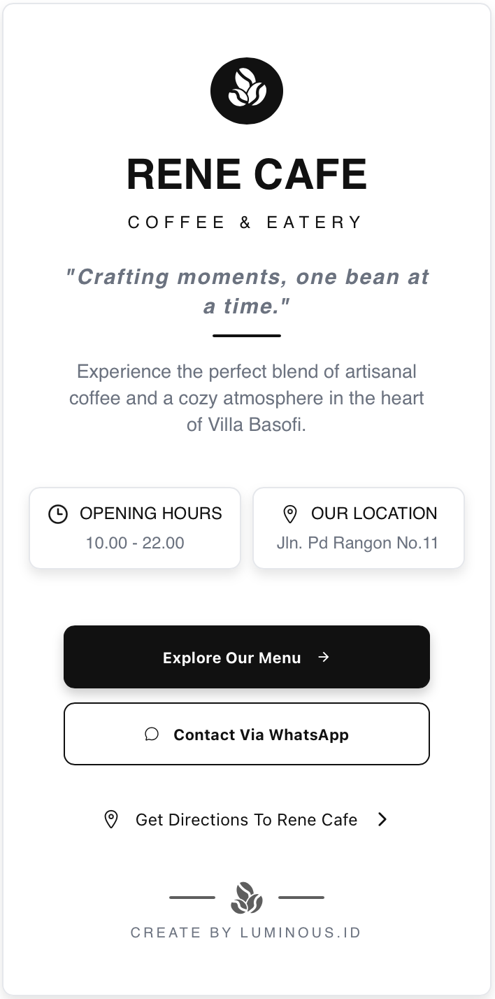
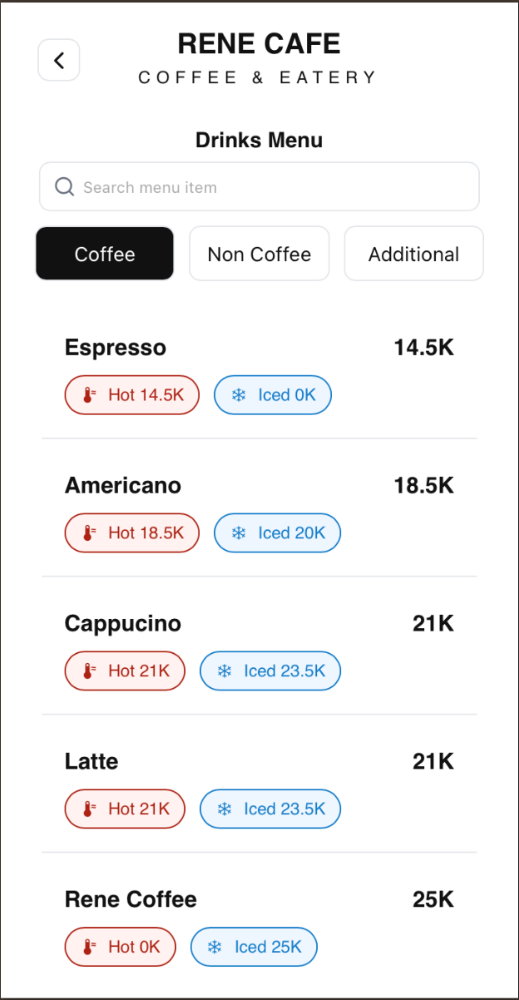

# ☕ Rene Cafe — Digital Menu Web App

A modern digital menu web app designed to deliver a seamless, app-like experience directly from the browser.
Built with a mobile-first approach, this project allows users to explore menus, search items, and interact just like a native application.

---

## Problem Statement

Rene Cafe previously displayed its menu using static images stored in Google Drive, such as catalog photos and promotional posters.

This approach created several usability issues:

* Menu presented as images instead of structured data
* Users had to zoom in and out to read menu items clearly
* Slower interaction when searching for specific items
* Poor mobile experience due to non-responsive content
* No search or filtering capability
* Dependency on external platforms (Google Drive)

As a result, the overall customer experience was less efficient and not aligned with modern digital standards.

---

## ✨ Solution

This project transforms the static menu into an interactive digital experience:

* Mobile-first, app-like UI
* Real-time search functionality
* Category-based navigation (Drinks, Meals, etc.)
* Fast and responsive performance
* Clean and structured menu layout
* Ready for integrations (WhatsApp ordering & Maps location)
---

## ✨ Features

*  Mobile-first, app-like UI
*  Real-time search menu items
*  Category-based navigation (Drinks, Meals, etc.)
*  Fast and responsive performance
*  Clean and minimal design
*  Integration-ready (WhatsApp & Google Maps)

---

## 🖼️ Preview

> Simple, elegant interface inspired by modern cafe experiences.

* Welcome screen with branding
* Menu selection page
* Interactive menu list

---

## 🛠️ Tech Stack

* ⚛️ React.js
* 🎨 CSS (Custom styling)
* 📦 Vite / Create React App (depending on setup)

---

## 🚀 Getting Started

### 1. Clone the repository

```bash
git clone https://github.com/your-username/rene-cafe-menu.git
cd rene-cafe-menu
```

---

### 2. Install dependencies

```bash
npm install
```

---

### 3. Run development server

```bash
npm start
```

or (if using Vite):

```bash
npm run dev
```

---

### 4. Open in browser

```bash
http://localhost:3000
```

---

## 📱 Testing on Mobile (Recommended)

To test the app directly on your phone:

1. Make sure your phone & laptop are on the same WiFi
2. Find your local IP:

   ```bash
   ifconfig
   ```
3. Open in your phone browser:

   ```bash
   http://YOUR_IP:3000
   ```

---

## 📂 Project Structure

```
src/
│
├── components/
├── pages/
├── data/
├── styles/
└── App.jsx
```

---

## 💡 Future Improvements

* 🛒 Add cart & ordering system
* 🔐 Authentication (Admin & User)
* 🧾 Order history
* 🌐 Backend integration (API)
* 📊 Dashboard for admin

---

## 🤝 Contributing

Feel free to fork this project and improve it!
Pull requests are welcome.

---

## 📄 License

This project is open-source and available under the MIT License.

---

## ☕ About

Built with passion to enhance digital dining experiences.
Rene Cafe Digital Menu aims to bring simplicity, speed, and elegance into one platform.

## About RENE CAFE
1. location https://www.google.com/maps/place/Rene+Cafe/data=!4m7!3m6!1s0x2e6993ee246aa691:0x31fb3bd7dd78af19!8m2!3d-6.3566556!4d106.9083157!16s%2Fg%2F11swyqmjpq!19sChIJkaZqJO6TaS4RGa943dc7-zE

## Deploy link 
https://cafe-menu-digital-peach.vercel.app

## Preview 



